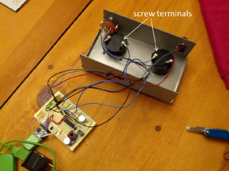
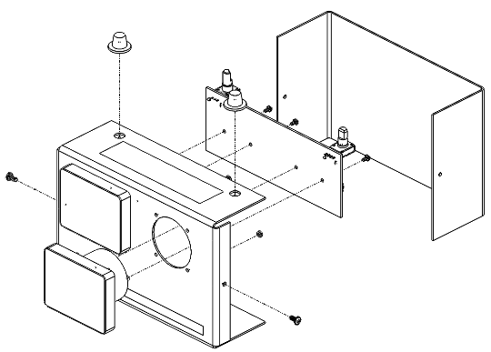
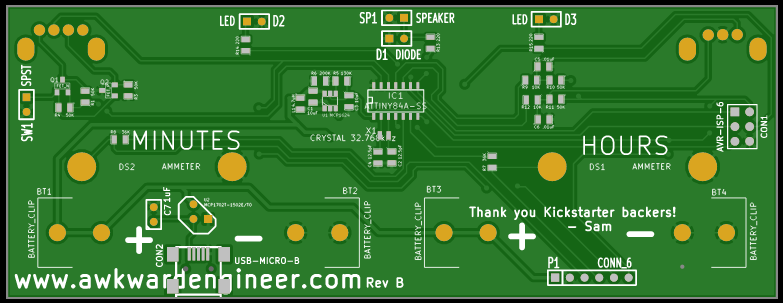

The Analog Voltmeter Clock was successfully Kickstarted in Jan 2015. The effort was a solo project and involved the business planning, marketing, industrial design, graphic design, electrical engineering, software engineering, mechanical engineering, and project management  

  
  
  
  
  
