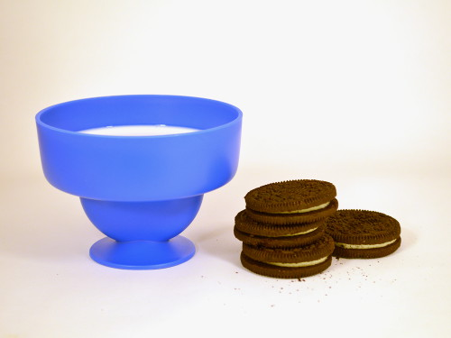
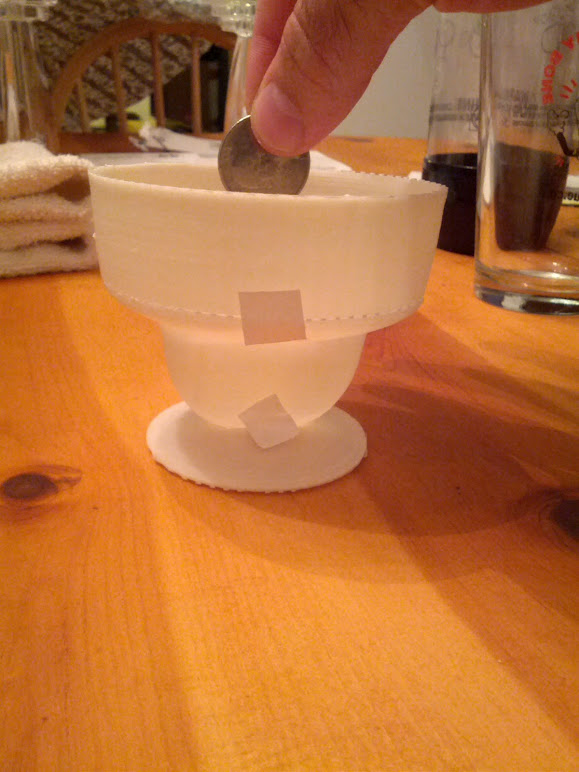
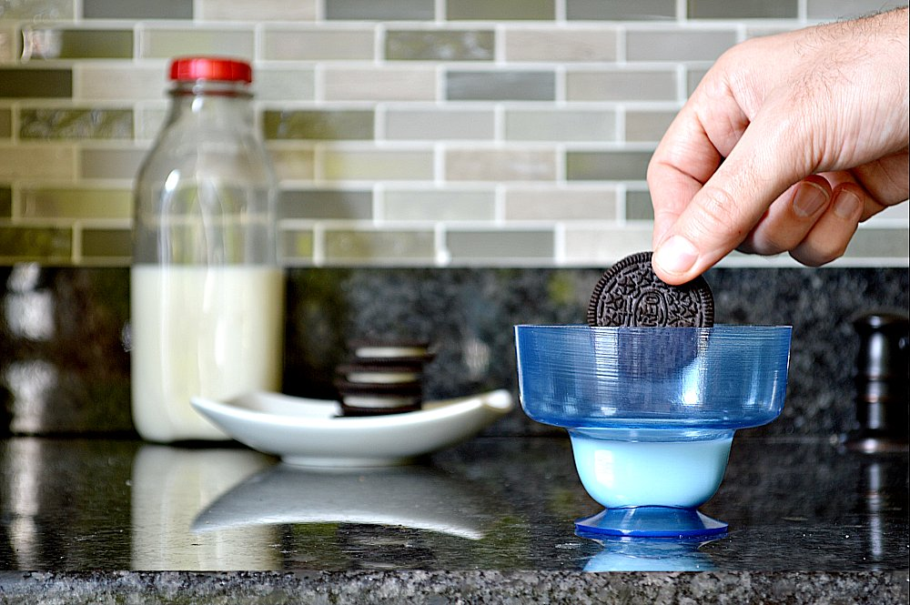

Described as the "first worldest of first world problems," the cookie cup was conceived out of a love for Oreos and a frustration with dunking them in a hard to reach, partially consumed glass of milk.  

I was responsible for the concept, industrial design, prototyping and CAD modeling. After a failed Kickstarter raised $8000, (short of the $25k goal), the product was licensed and brought to market.  

  
  
  
  
