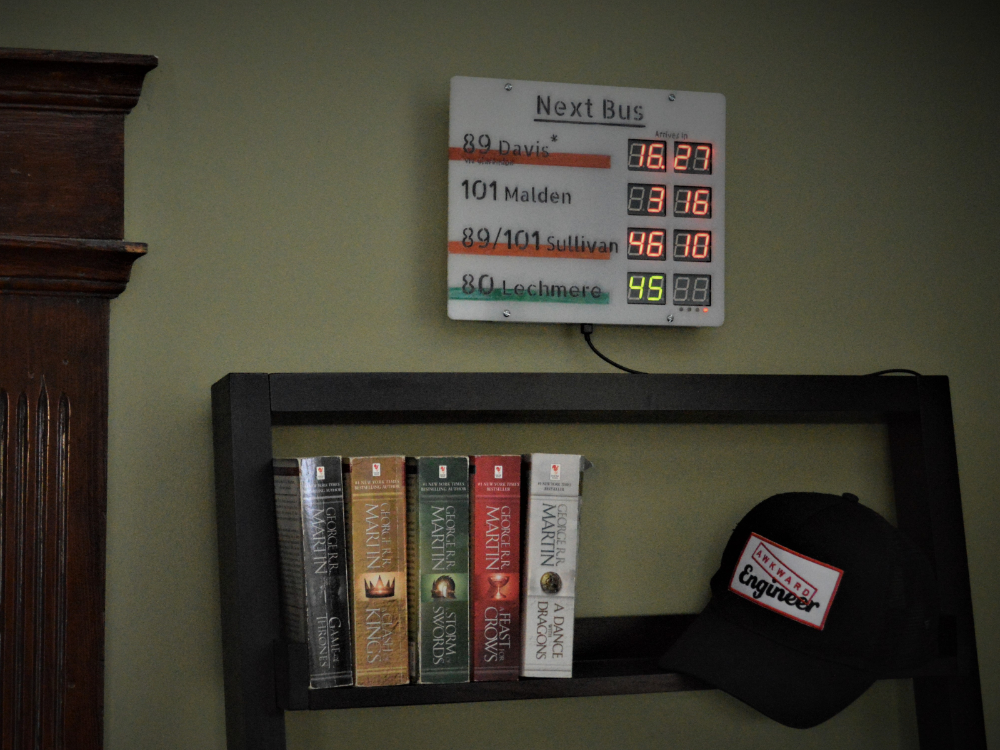
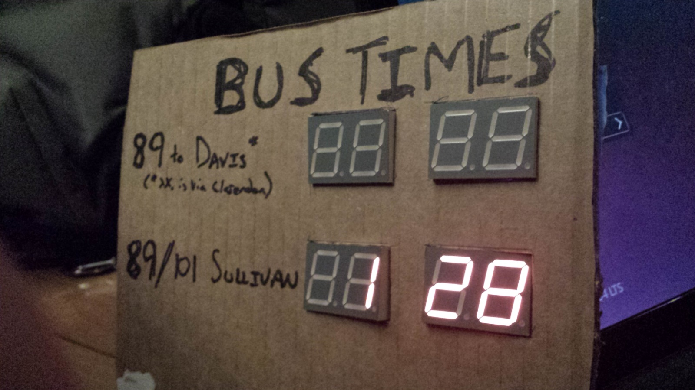
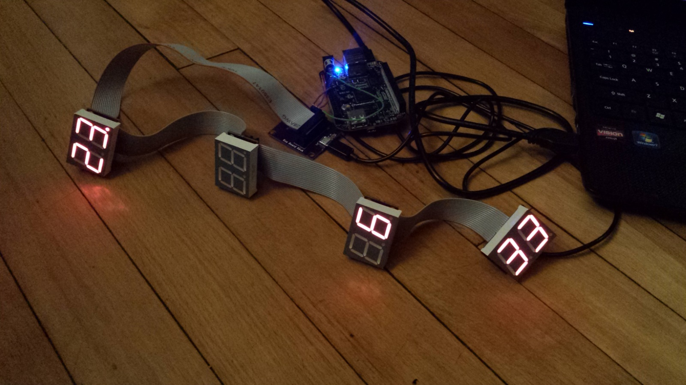
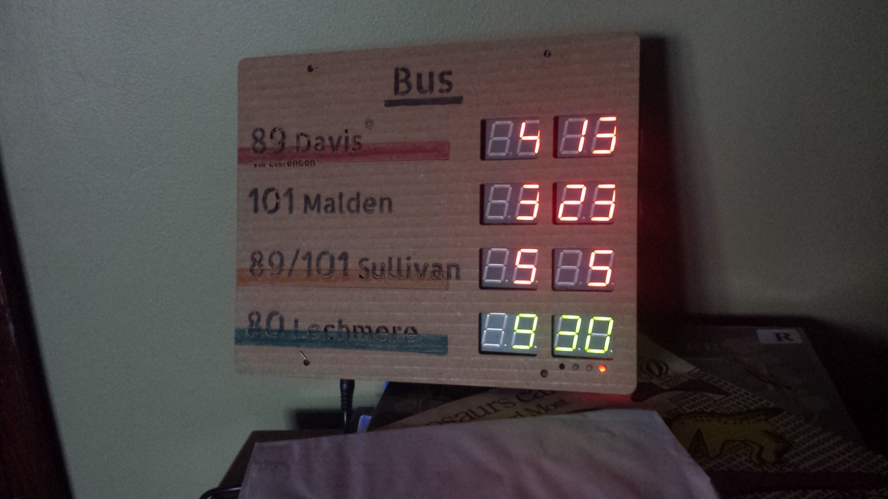
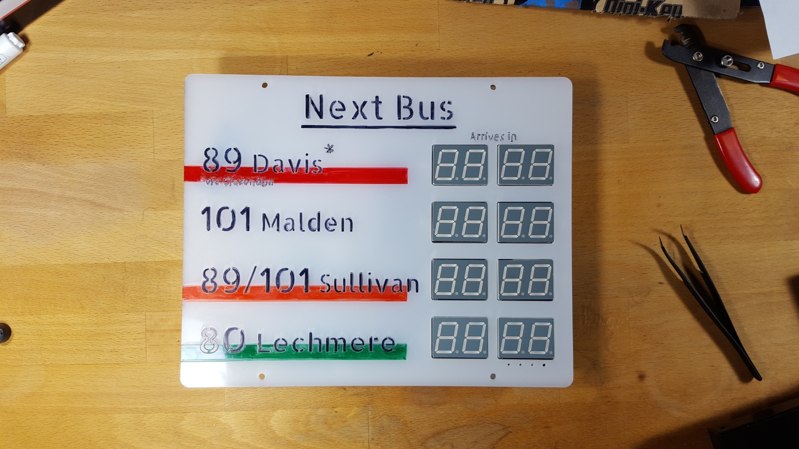

The NextBus sign was a personal project and a skill builder. It connects to the NextBus API which publishes a data feed for the bus arrival times on the MBTA and other transit systems.  

I developed this project for personal use, but was constantly thinking about what a commercialization effort would entail. The key obstacle was fitting a business model to the cost of maintaining an API, even though the hardware lends itself to a one time sale.

On the technical / design end, I developed the graphics and industrial design, mechanical housing, and custom circuit boards.

The sign uses a cloud connected Particle as the main microcontroller. To shorten development time, the NextBus API is processed off the microcontroller in Python and a short string is sent to the device itself through Particle's cloud back end. The Python script runs on an AWS instance in Amazon's cloud.

  
  
  
  
  
  
  
  
