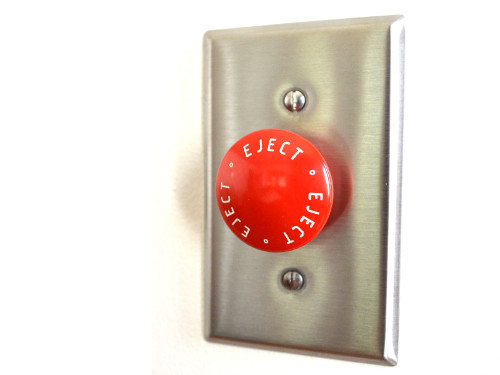
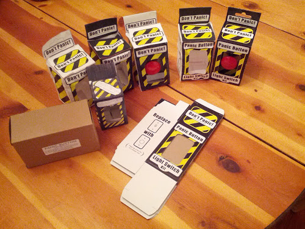
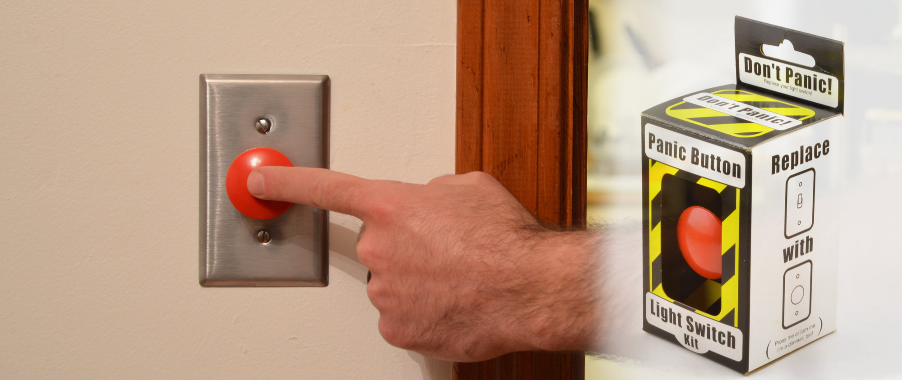

Solo project, brought from concept to market. I originally conceived the idea for the Kit when I tried to decorate my bedroom with an e-stop button. No consumer grade products were available, so I decided to make one.  

At it's peak, product had sales in the 1000's of units a year, and has been sold through ThinkGeek, Newbury Comics, Fab.com, Urban Outfitters, and other retailers.  

Skills used included component selection, vendor management, graphic design, web development, B2B sales, photography

  
  

