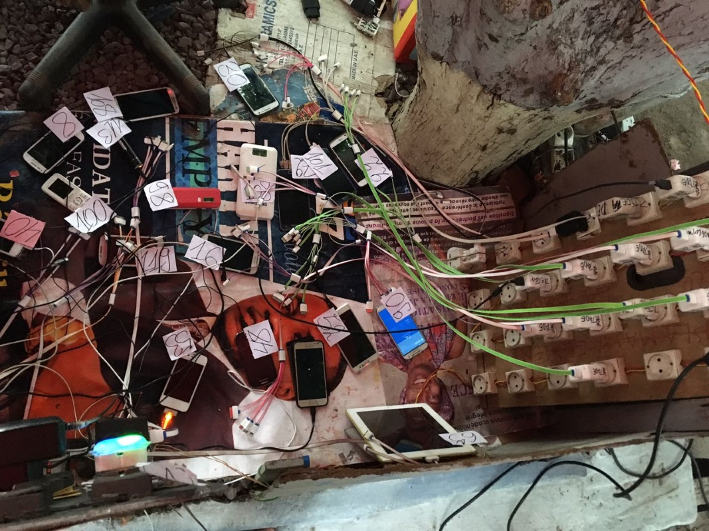
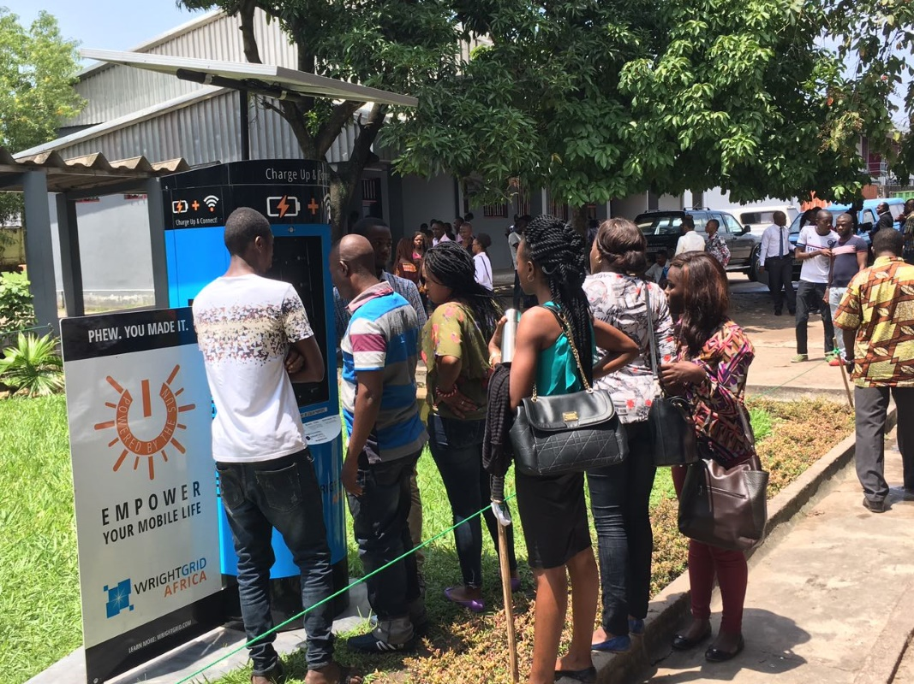
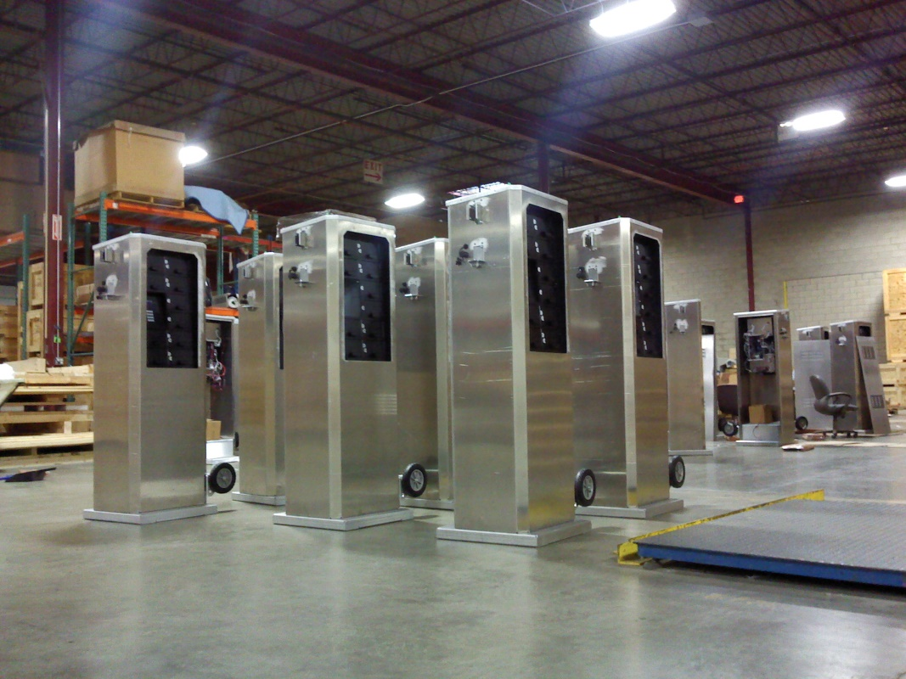
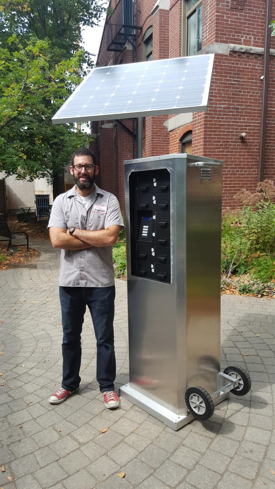
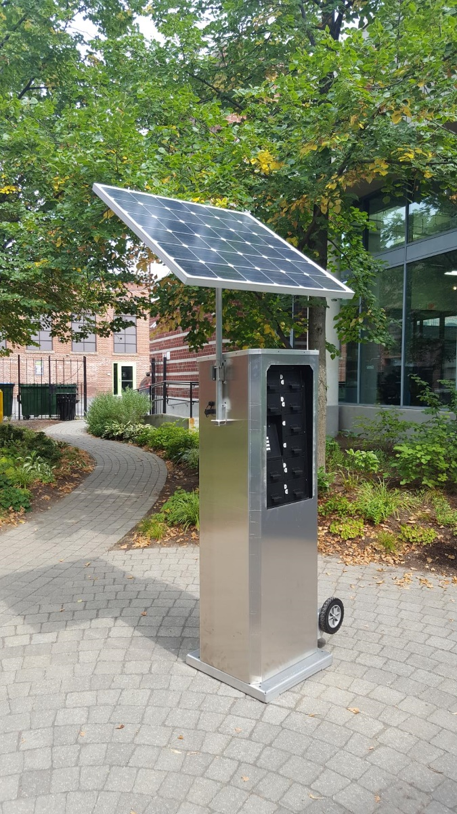

### During angel investor funded stage:
The company focus shifted towards development of a low cost, cloud connected, solar powered cell phone charging system for overseas deployment in the developing world. My role expanded to included product strategy, hiring the engineering team (electrical engineer, embedded software, and cloud software), and milestone and schedule planning. I supervised and mentored the electrical and software engineers.
### During grant funded stage:
Designed, built, and deployed close to two dozen outdoor cell phone charging stations in Massachusetts and select locations around the U.S. I lead the entire sheet metal design effort from concept to hand off to the contract manufacturer. I was responsible for vendor sourcing and management, BOM documentation, and unit installation. During this phase, the lead electrical engineer left, and I took over mentoring his junior assistant. I became heavily involved with the circuit board design, the development schedule, and took over the embedded software.
### During initial bootstrap phase:
I was one of two engineers (myself and an electrical engineer) on the team. We were little more than a garage operation, mostly cobbling together off-the-shelf and home depot parts to build working prototypes.

  
  
  
  
  
  
  
