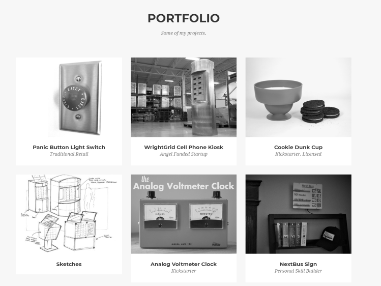

This portfolio is both a project showcase and a skills builder for myself. It started as a fork of the [Agency](https://startbootstrap.com/template-overviews/agency/) Bootstrap template which I initially modified to hardcode this site in HTML.  

I was looking for an easier way to update the site and had some interest in doing more with NodeJS.  

I settled on using [wintersmith.io](http://wintersmith.io/), a static website generator. Run on Node.js, it uses a simple folder structure and markdown files to automatically a generate a staticly served website. In this case, my portfolio is only a single page, but the separate folders and files for each project make everything easier to manage.  

Wintersmith didn't work perfectly out of the box, as I had to convert the existing hardcoded site into templates that could work with the wintersmith engine.

The static site is both managed and hosted in a [Github repo](https://github.com/awkwardengineer/Portfolio)

