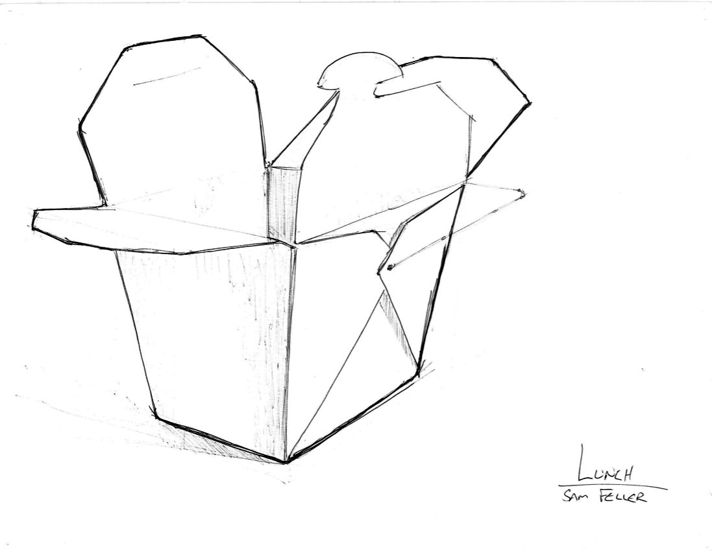

Being able to communicate graphically is a valuable skill and one I wanted to develop. I started with some community college art classes, saw significant improvement, and then started taking classes at MassArt.  

  
  
  
  
  

